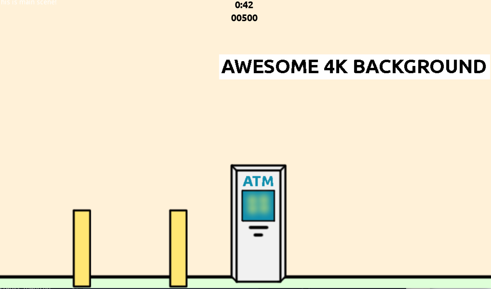

# The Greedy ATM

## About

You are an ATM with a greedy IA which doesn't hesitate to steal money from its users!

Multiple people will use you to cash their hard-earned cheques.
Every time an user uses you you will decide how much money return to him / her, and maybe you can return less than you were asked for...

But be careful! Not all users will simply walk away and will try to punch you in order to get his / her money back. In those cases you will have to defend yourself and your booty!

Made in 13 hours for [Ludum Dare #44](https://ldjam.com/events/ludum-dare/44/$151494).

## Controls

### Dialogue fase

Mouse - Select and confirm return value

### Defense fase

Mouse - Click on exclamation marks the fastest you can in order to defend from that hit

## Credits

### Idea, programming, graphics and sound

Moisés J. Bonilla Caraballo (https://www.moisesjose.com)

### Third party work and tools used

#### Software

Godot Engine (https://godotengine.org/)
GIMP (https://www.gimp.org/)

#### Fonts

Ubuntu-B.ttf
